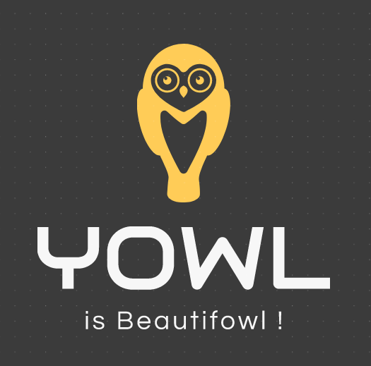

# YOWL

### First thing first : clone the project in your choosen path by copying and pasting the fowolling command in your CLI

```bash
git clone git@github.com:EpitechCodingAcademyPromo2022/C-DEV-160-STG-1-2-yowl-valentin.lorquin.git
```
<br />

## 1. In the back/YowlBack folder...

### Create the dbyowl database in your mySql server

```
create database dbyowl;
```

### PHP packet manager -> Laravel Installation (beware your PHP version is up to date)

##### For linux users

```
apt install composer
```

##### For macOS users

```
brew install composer
```

### Node modules and project depedencies installation and setup

```
npm install
```

### Create the tables with
```
php artisan make:migration
```

### Lauch the project

```
php artisan serve
```

### Or use Docker instead of the previous steps

```
docker-compose up
```
<br>

## 2. In the back/YowlBack folder...

### Node modules and project depedencies installation and setup for VueJs

```
npm install
```

### Compiles and hot-reloads for development

```
npm run serve
```

### Compiles and minifies for production

```
npm run build
```

<br>

### And... don't hesitate to stop and restart sometimes your front server to flush his cache 😅 🐛
# Projet-Fin-Tronc-Commun

Dans ce prpjet j'avais la responsabilité de coder l'api et le back pour notre site. Les delais étant court j'ai cependant rapidement pris la position de lead développeur de mon groupe afin d'aider tout le monde et faire en sorte que nous reussissions a rendre un quelquechose de correcte.
